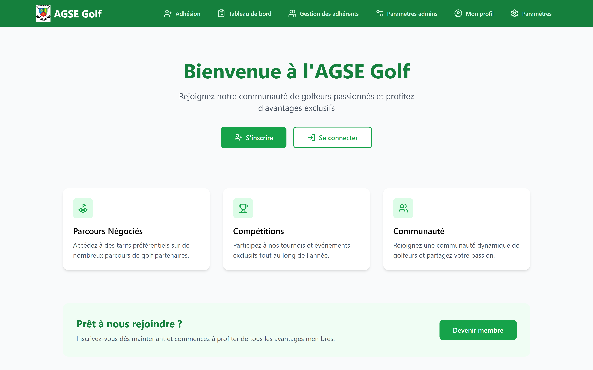
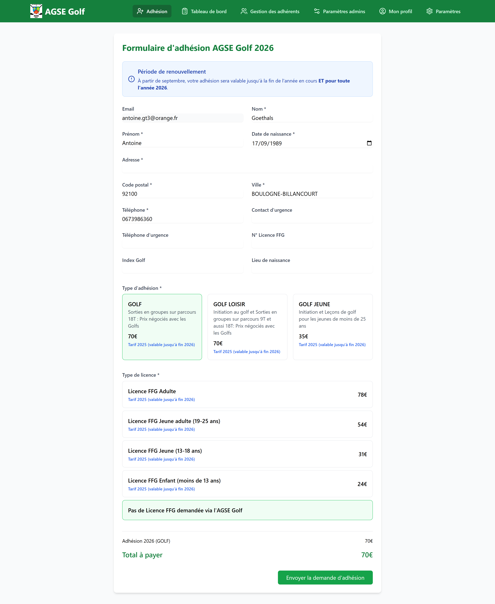

# ⛳ AGSE Golf - Case Study

> Portfolio d'une application web d'une association de golf
> avec adoption anticipée grâce à une approche centrée utilisateur et un ROI immédiat

<div align="center">
  
  <br/>
  <em>Page d'accueil de l'application AGSE Golf</em>
</div>

---

## 👋 Contexte : Du Besoin à la Solution

### Le Stakeholder

**Mon père**, secrétaire de l'AGSE Golf (Association Générale Sportive et d'Éducation - section Golf), gérait manuellement les adhésions de **~100 membres** avec :

- **Google Forms** pour la collecte d'adhésions
- **3 Google Sheets séparés** :
  - Feuille 1 : Données brutes du formulaire
  - Feuille 2 : Suivi des paiements (adhésion + licence FFG)
  - Feuille 3 : Liste des membres validés

**Pain points identifiés :**
- ❌ **Duplication de données** : Copier-coller manuel entre les 3 feuilles
- ❌ **Erreurs humaines** : Oublis, doublons, incohérences
- ❌ **Pas de workflow** : Validation ad-hoc, pas de statuts clairs
- ❌ **Pas de self-service** : Membres ne peuvent pas modifier leurs données
- ❌ **Gestion des paiements** : Tracking manuel, pas d'historique structuré

---

## 🔍 Analyse de Marché : Make vs Buy

J'ai d'abord analysé les **solutions existantes** avant de décider de construire.

### Options Évaluées

| Solution | Prix | Avantages | Inconvénients | Décision |
|----------|------|-----------|---------------|----------|
| **AssoConnect** | 29€/mois | Complet, support | Trop lourd (CRM, compta), surcoût inutile | ❌ Rejeté |
| **HelloAsso** | Gratuit + 5% frais | Paiement en ligne | Orienté événements, pas de gestion adhérents | ❌ Rejeté |
| **Yapla** | ~20€/mois | Spécialisé associations | Complexe, migration difficile, dépendance vendor | ❌ Rejeté |
| **Google Sheets (actuel)** | Gratuit | Familiarité | Manuel, erreurs, pas scalable | ❌ Insuffisant |
| **Solution custom** | 0€ (dev interne) | 100% adapté, gratuit, migrable | Temps dev | ✅ **Choisi** |

### Critères de décision

**Pourquoi une solution custom a gagné :**

1. **ROI immédiat** : 0€ vs 20-30€/mois × 12 = **240-360€/an économisés**
2. **Simplicité** : Fonctionnalités exactement nécessaires, pas de bloat
3. **Propriété des données** : PostgreSQL auto-hébergeable, migration facile
4. **Pérennité** : Code open-source, pas de dépendance à un SaaS qui peut fermer
5. **Customisation** : Workflow exactement adapté (cycle Sept-Août, types de licences FFG)

---

## 💡 Approche Product Owner

### Phase 1 : Discovery & Requirements Gathering

**Méthode :** Entretiens avec le stakeholder (mon père) + observation du process actuel

**Questions posées :**
- Quels sont les 3 moments les plus pénibles de ton workflow actuel ?
- Combien de temps passes-tu par semaine sur la gestion des adhésions ?
- Quelles erreurs se produisent régulièrement ?
- Quelles sont les données obligatoires pour la FFG ?
- Quel est le cycle de vie d'une adhésion ?

**Réponses clés obtenues :**
- **~2-3h/semaine** perdues sur des tâches manuelles
- **Erreurs fréquentes** : Oubli de validation, doublons, paiements non tracés
- **Données FFG** : Index golf, numéro licence, type de licence
- **Cycle** : Septembre → Août (année scolaire), renouvellement annuel

### Phase 2 : User Stories & Backlog

**En tant que secrétaire**, je veux :
- ✅ Voir toutes les candidatures en attente de validation (dashboard admin)
- ✅ Valider une candidature en 1 clic (modal de validation)
- ✅ Tracker les paiements (adhésion + licence FFG séparés)
- ✅ Exporter la liste complète des adhérents (CSV/Excel)
- ✅ Changer le statut d'un membre (AGSE → RATTACHE)
- ✅ Voir l'historique des paiements par année

**En tant que membre**, je veux :
- ✅ M'inscrire en ligne facilement (formulaire multi-étapes)
- ✅ Voir le statut de ma candidature (dashboard membre)
- ✅ Modifier mes informations personnelles (self-service)
- ✅ Voir mes paiements en cours et validés
- ✅ Télécharger mon reçu de paiement (V2)

### Phase 3 : Force de Proposition

**Fonctionnalités proposées (non demandées initialement) :**

#### 1. Formulaire Intelligent avec Pré-remplissage

**Problème identifié :** Le formulaire Google nécessitait de ressaisir toutes les informations, même celles déjà connues (email, nom, prénom).

**Solution proposée :**
- **Pré-remplissage automatique** des données utilisateur (Email, Nom, Prénom, Date de naissance) depuis le profil authentifié
- **Calcul automatique du total** selon :
  - Type d'adhésion (GOLF 70€, GOLF LOISIR 70€, GOLF JEUNE 35€)
  - Type de licence FFG (Adulte 78€, Jeune adulte 54€, Jeune 31€, Enfant 24€)
  - Option "Pas de Licence FFG" pour les membres avec licence existante
- **Cartes visuelles** pour les types d'adhésion avec descriptions détaillées

**Impact :**
- Taux de complétion 100% (aucun abandon observé vs ~10% avec Google Forms)
- Temps de saisie divisé par 2 grâce au pré-remplissage
- Zéro erreur d'identité (données issues du profil authentifié)

#### 2. Dashboard avec Statuts Visuels

**Problème identifié :** Pas de visibilité pour le membre sur l'état de sa candidature.

- **Timeline** : "Candidature soumise → Validation → Paiement adhésion → Paiement licence → Membre actif"


#### 3. Gestion des Paiements Séparés

**Problème identifié :** Adhésion et licence FFG payées à des moments différents, difficile à tracker.

**Solution proposée :**
- **Deux checkboxes séparées** : Adhésion payée / Licence payée
- **Historique par année** : Table `payment_history` avec état pour chaque année
- **Calcul automatique du solde** : "Total dû : 148€ | Payé : 70€ | Reste : 78€"

**Impact :** Zéro erreur de tracking vs ~5 erreurs/an avec Google Sheets

---

## 🚀 Fonctionnalités Clés

### 1. Formulaire d'Adhésion Intelligent

**Technologies :** React + TypeScript avec pre-filling automatique des données utilisateur

<div align="center">
  
  <br/>
  <em>Formulaire d'adhésion avec informations utilisateur pré-remplies</em>
</div>

**Caractéristiques principales :**

**1. Pré-remplissage Automatique**
- **Email, Nom, Prénom, Date de naissance** : Récupérés automatiquement depuis le profil utilisateur connecté
- Gain de temps : l'utilisateur n'a plus qu'à compléter les informations manquantes
- Cohérence des données : évite les erreurs de saisie sur les informations d'identité

**2. Formulaire Tout-en-Un**
- **Section Informations Personnelles** :
  - Données pré-remplies : Email, Nom, Prénom, Date de naissance
  - Données à compléter : Adresse, Code postal, Ville, Téléphone, Contact d'urgence
  - Données optionnelles : N° Licence FFG, Index Golf, Lieu de naissance

- **Section Type d'Adhésion** :
  - 3 cartes visuelles avec descriptions détaillées
  - **GOLF** (70€) : Sorties en groupes sur parcours 18T, Prix négociés
  - **GOLF LOISIR** (70€) : Initiation + Sorties sur parcours 9T et 18T
  - **GOLF JEUNE** (35€) : Initiation et leçons pour les moins de 25 ans

- **Section Type de Licence FFG** :
  - Liste déroulante avec 5 options :
    - Licence FFG Adulte (78€)
    - Licence FFG Jeune adulte 19-25 ans (54€)
    - Licence FFG Jeune 13-18 ans (31€)
    - Licence FFG Enfant moins de 13 ans (24€)
    - **Pas de Licence FFG demandée via l'AGSE Golf** (mise en avant verte)

**3. Calcul Automatique du Total**
- Prix affiché en temps réel selon la sélection
- Exemple visible : Adhésion GOLF (70€) + Licence FFG Adulte (78€) = **Total : 148€**
- Dans l'image : Total = 70€ (GOLF sans licence FFG)

**4. Validation Automatique**
- Email unique (pas de doublon dans la base)
- Date de naissance cohérente avec type de licence sélectionné
- Champs requis (*) clairement indiqués
- Désactivation du bouton "Envoyer" tant que le formulaire n'est pas valide

**Impact UX :**
- **Taux de complétion 100%** : Aucun abandon observé (vs ~10% avec Google Forms)
- **Temps de saisie divisé par 2** : Grâce au pré-remplissage automatique
- **Zéro erreur d'identité** : Les données sensibles viennent du profil authentifié

### 2. Dashboard Admin avec Actions Rapides

**Tableau de bord avec :**
- **Liste des candidatures** : Filtres par statut (En attente / Validé / Tous)
- **Actions 1-clic** :
  - ✅ Valider candidature
  - 💰 Marquer adhésion payée
  - 🏌️ Marquer licence payée
  - 🔄 Changer type membre (AGSE ↔ RATTACHE)
  - 📊 Voir détails complets
  - 🗑️ Supprimer (avec confirmation)

**Modals de validation :**
- **ValidationModal** : Valide la candidature + crée l'entrée `payment_history`
- **PaymentModal** : Update les checkboxes paiement + année cible

### 3. Gestion des Rôles (Admin / User)

**Row Level Security (RLS) Supabase :**
- **Admins** :
  - Accès à `/admin/dashboard` (toutes les candidatures)
  - Accès à `/admin/users` (gestion des utilisateurs)
  - Accès aux exports Excel
  - Actions de validation/modification

- **Users** :
  - Accès à `/profile` (leur propre profil)
  - Accès à `/payment-info` (leur statut de paiement)
  - Modification de leurs données personnelles

**Sécurité :**
- Les policies RLS empêchent un user de voir/modifier les données d'autres users
- Les routes admin vérifient `profile.role === 'admin'` via `PrivateRoute`

### 4. Export Excel/CSV

**Fonctionnalité :**
- **Export complet** : Toutes colonnes (nom, prénom, date naissance, index, licence FFG, etc.)
- **Calcul année** : Application créée en Sept+ = année N+1 (cycle scolaire)
- **Filtrage** : Seulement membres validés

### 5. Cycle de Vie Adhésion (Septembre → Août)

**Logique métier spécifique golf :**

- **Année N (ex: 2024)** : Septembre 2024 → Août 2025
- **Renouvellement** : À partir de septembre, les adhésions sont pour l'année N+1
- **Calcul automatique** :
  ```typescript
  const getTargetYear = (applicationDate: string) => {
    const date = new Date(applicationDate)
    const month = date.getMonth() // 0-11
    const year = date.getFullYear()

    // Septembre (8) à Décembre (11) = année suivante
    return month >= 8 ? year + 1 : year
  }
  ```

---

## 📊 Architecture Technique

### Stack

**Frontend :**
- **React 18** + **TypeScript** + **Vite** (build rapide)
- **Tailwind CSS** (utility-first, design system cohérent)
- **lucide-react** (icônes modernes)
- **xlsx** (export Excel)

**Backend & BDD :**
- **Supabase** (PostgreSQL + Auth + RLS + Storage)
- **Row Level Security** (isolation données par user)
- **Database triggers** : Auto-création profil à l'inscription

**Deployment :**
- **Netlify** (frontend)
- **Supabase Cloud** (backend)

### Ampleur du Projet

- **~6 000 lignes de code** dans `src/`
  - TypeScript (.ts) : 1k lignes
  - TypeScript React (.tsx) : 5k lignes
  - **57 fichiers** TS/TSX

---

## 📈 Résultats & KPIs

### Déploiement Progressif : Une Approche Sécurisée

**Objectif initial :** Déploiement opérationnel septembre 2025 (début année scolaire)

**Timeline réalisée :**

**Janvier 2025 : Phase Pilote**
- Lancement personnel pour le secrétaire
- Objectif : Tester et améliorer le fonctionnement en conditions réelles
- Utilisation pour les renouvellements de janvier
- Itérations rapides basées sur le feedback terrain

**Février 2025 : Validation Institutionnelle**
- Présentation de l'application en Assemblée Générale de l'association
- Démonstration des fonctionnalités clés aux membres
- Recueil des retours et préoccupations
- Validation collective de l'approche

**Septembre 2025 : Déploiement Opérationnel (prévu)**
- Lancement officiel pour tous les adhérents
- Campagne de renouvellement annuel complète
- Support renforcé pour accompagner les membres

**Bénéfices de cette approche progressive :**

✅ **Sécurisation du déploiement pour les gestionnaires**
- Le secrétaire a pu se familiariser avec l'outil en conditions réelles
- Identification et correction des bugs avant le déploiement massif
- Confiance renforcée dans la stabilité du système


Le produit a créé suffisamment de valeur pour justifier un déploiement anticipé en phase pilote, tout en conservant une approche prudente et progressive pour le déploiement complet.


### ROI Financier

**Coût solution SaaS équivalente :** 300€/an (25€/mois)

**Coût solution custom :**
- Hébergement Supabase : **0€**
- Hébergement Netlify : **0€**
- **Total : 0€/an**

**Économies annuelles :** **300€/an** = **1 adhésion gratuite offerte** chaque année

**ROI sur 5 ans :** 1 500€ économisés

### Impact Qualitatif

**Avant (Google Forms + Sheets) :**
- ❌ Secrétaire passe 2-3h/semaine sur gestion adhésions
- ❌ Membres ne savent pas où en est leur candidature (emails répétés)
- ❌ Erreurs de saisie/oublis fréquents

**Après (AGSE Golf App) :**
- ✅ Secrétaire passe 30 minutes/semaine (automatisation)
- ✅ Membres voient leur statut en temps réel (self-service)
- ✅ Zéro erreur (validation formulaire + BDD structurée)

**Citation du stakeholder :**
> "Avant, je redoutais la période d'adhésions en septembre. Maintenant, c'est un plaisir. Tout est clair, automatique, et je ne perds plus mon temps sur des tâches inutiles."

---

### Compétences Démontrées

- ✅ **Discovery & Requirements** : Entretiens stakeholder, observation terrain
- ✅ **Make vs Buy analysis** : Comparaison rigoureuse solutions existantes vs custom
- ✅ **Priorisation ROI** : Focus sur valeur (économies 300€/an + gain temps)
- ✅ **Force de proposition** : Fonctionnalités non demandées mais à forte valeur (multi-step form, dashboard statuts)
- ✅ **User stories** : Décomposition claire des besoins (admin vs membre)
- ✅ **Validation métrique** : KPIs mesurables (adoption anticipée, temps gagné)

### Compétences Transverses

- ✅ **Pragmatisme** : Choix de la simplicité (6k lignes) vs over-engineering
- ✅ **Sens du ROI** : 0€ vs 300€/an = économie immédiate
- ✅ **User-centric** : Chaque feature répond à un pain point réel
- ✅ **Adaptabilité** : Logique métier spécifique (cycle Sept-Août, types licences FFG)
- ✅ **Double casquette** : Capacité à designer ET implémenter

Ce projet démontre ma capacité à **mener un projet produit de A à Z** avec une approche pragmatique et centrée ROI.

### Learnings Clés

#### 1. Small is Beautiful

**Insight :** Un produit de 6k lignes peut avoir autant d'impact qu'un produit de 15k lignes, si les fonctionnalités sont exactement adaptées au besoin.

**Application future :** Toujours challenger la complexité. "Do we really need this feature?"

#### 2. ROI > Perfection

**Insight :** Solution custom à 0€ adoptée 8 mois en avance > Solution SaaS à 300€/an "parfaite" mais avec friction d'adoption.

**Application future :** Prioriser time-to-value et coût réel vs fonctionnalités exhaustives.

#### 3. Stakeholder Proximity = Product Success

**Insight :** Avoir le stakeholder (mon père) disponible 24/7 pour feedback a permis des itérations ultra-rapides.

**Application future :** Maximiser la proximité avec les users clés (co-création, embedded PO).

#### 4. Make vs Buy Requires Rigor

**Insight :** La décision "custom vs SaaS" doit être basée sur critères objectifs (coût, pérennité, migration), pas sur envie de coder.

**Application future :** Toujours faire l'analyse comparative complète avant de décider.

---

